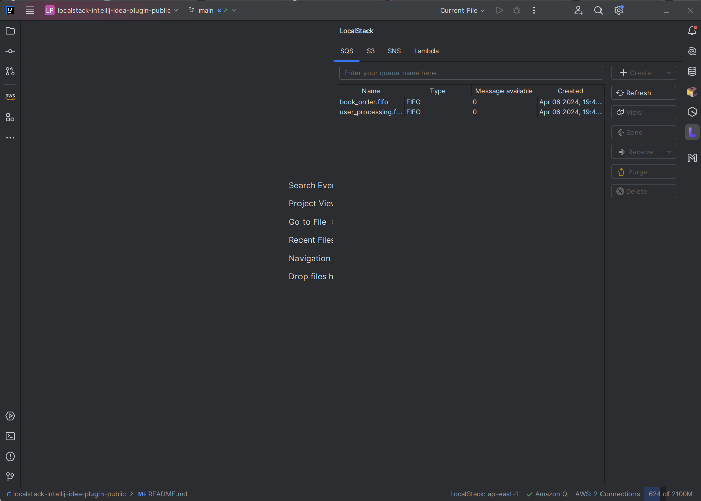
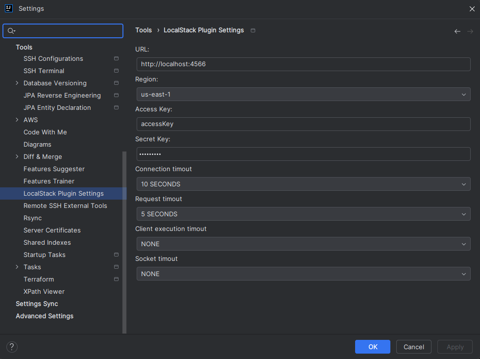
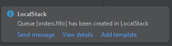
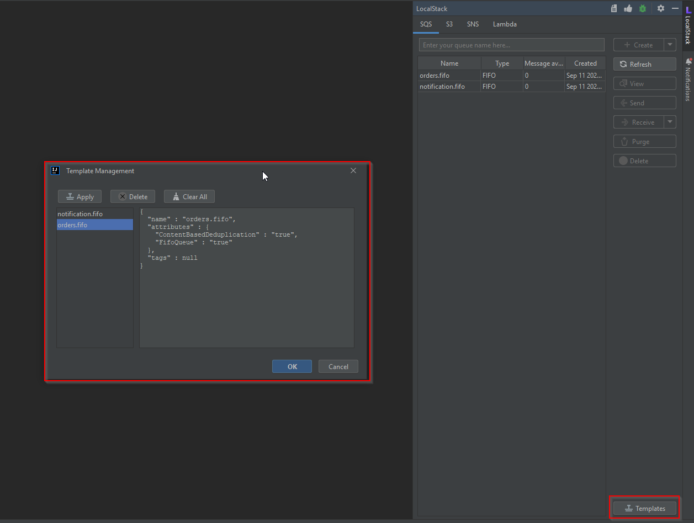
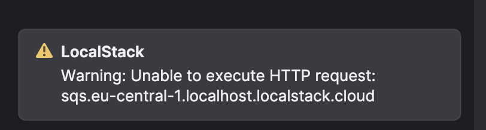
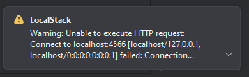

# LocalStack Plugin for IntelliJ IDEA 🚀
## Table of Contents
1. [Description](#description)
2. [Configuration](#configuration)
3. [Services](#services)
   - [SQS](#sqs)
   - [S3](#s3)
   - [SNS](#sns)
   - [Lambda](#lambda)
4. [Template Management](#template-management)
5. [Troubleshooting](#troubleshooting)
6. [Donations](#donations)

## Description
The LocalStack plugin for IntelliJ IDEA is designed exclusively for IntelliJ IDEA users, enabling them to create and
manage resources in LocalStack directly from their IDE. This plugin supports several AWS services like SQS, S3, SNS,
and Lambda, with ongoing development to introduce more services in the future.

A newly introduced **Template Management** feature allows users to save configurations of SQS queues, enabling quick
creation of resources based on predefined templates. This makes it easier for developers to replicate SQS configurations
in future projects.

Given our small development team, we are unable to add a large number of services quickly. If you find this project
helpful, please consider supporting us by purchasing a subscription or making a [donation](#donations). The plugin operates on a
freemium model, offering both free and paid features.



## Configuration
To integrate LocalStack into your IntelliJ IDEA environment seamlessly, the plugin allows for easy configuration
of various LocalStack settings, including:
- URL
- Region
- Access Key and Secret Keys
- Timeout settings

These configurations ensure that your LocalStack environment aligns with your project's needs.

In order to configure these settings please follow the steps:
1. Go to `File` -> `Settings`
2. On the left side, select Tools and then choose `LocalStack Plugin Settings`.
3. Apply your changes, and
4. Restart you IDE and enjoy :)



## Services
The plugin provides support for a range of services, each with its own set of features:

### SQS
- Create SQS queue (Standard)
- Create SQS queue (FIFO)
- Create SQS queue (Advanced)
- Get list of queues
- View queue attributes
- Send message to queue
- Receive a message from queue
- Receive a message from queue (Recording mode)
- Beautify received message (JSON)
- Copy received message
- Purge queue
- Delete queue
- **Create SQS queue from template** (available via [Template Management](#template-management))

### S3
- Create S3 bucket (Simple)
- Get list of S3 buckets
- Delete S3 bucket
- Create folders in S3 bucket
- Navigate through S3 bucket folders
- Upload objects to S3 buckets
- Upload folders to S3 buckets
- Upload objects to S3 buckets from Project View pop-up
- Upload folders to S3 buckets from Project View pop-up
- Delete objects from S3 bucket
- View objects in S3 bucket

### SNS
- Create SNS topic (Simple)
- View SNS topic attributes
- Delete SNS topic

### Lambda
- Create Lambda function
- Invoke Lambda function
- Delete Lambda function

## Template Management
The **Template Management** feature allows users to create and manage templates for SQS queues. This feature provides 
a streamlined way for developers to quickly replicate configurations across projects without manually inputting 
settings every time.

### Creating a Template
Once you create an SQS queue using any of the available options (Standard, FIFO, Advanced), you will now have the 
option to save that queue configuration as a template. This will store the SQS configuration (attributes like queue 
name, type, visibility timeout, etc.) so that you can easily reuse it later.



### Managing Templates
You can view, apply, or delete previously created templates from the **Template Management** screen. This allows you to keep your templates organized and modify them as your project needs change.



### Creating SQS Queues from Templates
To create an SQS queue from a saved template:
1. Go to the **Template Management** window.
2. Select the desired template from the list.
3. Click the "Apply" button.
4. The plugin will automatically create a new SQS queue based on the selected template, with all the pre-configured settings.

This feature allows you to quickly set up SQS queues with consistent configurations, speeding up development workflows 
and reducing the potential for configuration errors.

## Troubleshooting
### Case 1: DNS resolving issues on MacOS
If you configured the settings correctly but for some reason the following error appears



That's an issue on the LocalStack, to solve this please add the following DNS rules
to hostname mapping file: 
```
127.0.0.1 sqs.eu-central-1.localhost.localstack.cloud
```
Typically this file located here
- Windows: `C:\Windows\System32\drivers\etc\drivers`
- MacOS or Linux: `/etc/hosts`

### Case 2: Localstack is not running
If you see the following message then the localstack is down.



Follow this installation guide to install localstack. https://docs.localstack.cloud/getting-started/installation/

## Donations
Love the LocalStack plugin for IntelliJ IDEA? Consider supporting our project through donations or by purchasing a subscription. Your support helps us maintain and expand the plugin's capabilities, ensuring it meets the community's needs.

1. [PayPal](https://www.paypal.com/donate/?hosted_button_id=Y3KMBWW4WVESS)
2. [BuyMeACoffee](https://www.buymeacoffee.com/dmytro.kozhanov)
3. or just [purchase a subscription](https://plugins.jetbrains.com/plugin/22223-localstack-integrator/pricing#tabs).